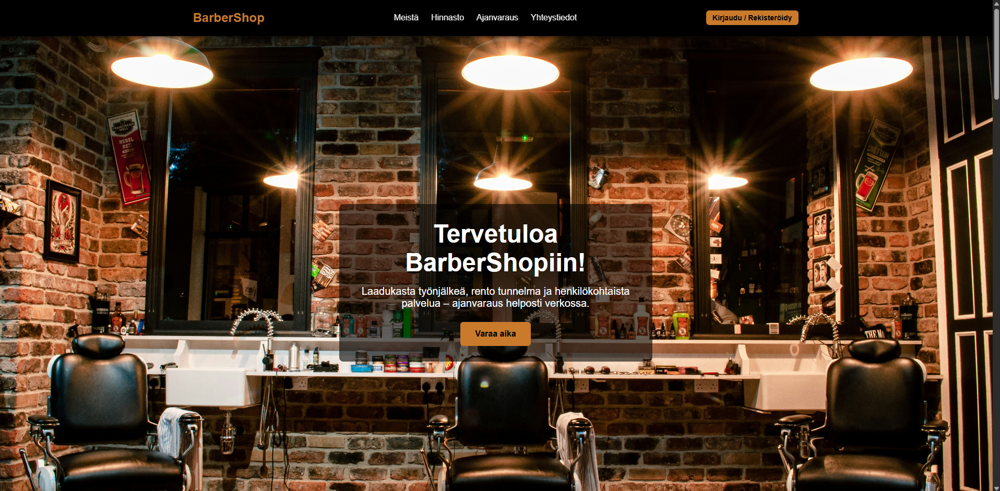
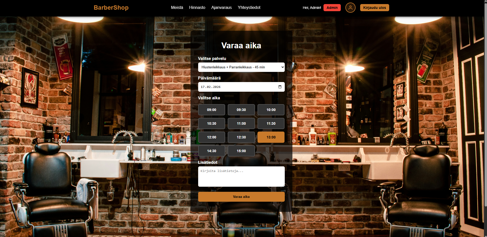
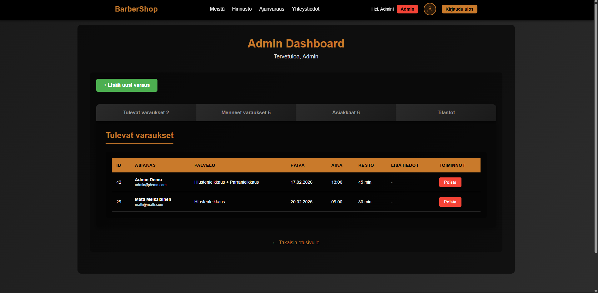

# BarberShop - Ajanvarausjärjestelmä

Moderni parturi-varausjärjestelmä, joka tarjoaa käyttäjille helpon tavan varata aikoja verkossa. Projekti on osa ohjelmistokehittäjäopintojani ja portfolio-työtäni.


---

## Live Demo

Projekti on nähtävissä live-demona osoitteessa:
**[jessehaapaniemi.com/barber-booking-system](https://www.jessehaapaniemi.com/barber-booking-system/public/)**

### Demo-tunnukset

**Admin-tunnus:**
- Sähköposti: `admin@demo.com`
- Salasana: `password`

**Tavallinen käyttäjä:**
- Voit luoda oman tunnuksen rekisteröitymällä

---

## Ominaisuudet

### Käyttäjälle
- Turvallinen käyttäjäautentikointi (rekisteröinti ja kirjautuminen)
- Dynaaminen ajanvarausjärjestelmä (valitse palvelu, päivä ja vapaa aika)
- Reaaliaikainen aikojen tarkistus (näkee vain vapaat ajat)
- Käyttäjäprofiili varaushistorialla
- Varausten peruutus ja hallinta
- Täysin responsiivinen design (toimii mobiilissa, tabletissa ja tietokoneella)

### Admin-käyttäjälle
- Admin-hallintapaneeli varausten hallintaan
- Tilastot (tänään, viikko, kuukausi)
- Uusien varausten lisäys
- Varausten muokkaus ja poisto
- Asiakashallinta GDPR-yhteensopivuudella
- Asiakashaku nimellä tai sähköpostilla

### Turvallisuus
- PDO prepared statements (SQL-injection esto)
- Password hashing (bcrypt)
- CSRF-suojaus kaikissa lomakkeissa
- XSS-suojaus (htmlspecialchars)
- Session-turvallisuus

---

## Teknologiat

### Backend
- **PHP 8.x** - Palvelinpuolen logiikka
- **MySQL** - Tietokanta
- **PDO** - Tietokanta-abstraktio ja turvallinen kyselyiden käsittely

### Frontend
- **HTML5** - Semanttinen rakenne
- **CSS3** - Moderni tyylittely (Flexbox, Grid, Gradient)
- **JavaScript (ES6+)** - Dynaaminen käyttöliittymä
- **Fetch API** - Asynkroniset HTTP-pyynnöt

---

## Projektin rakenne
```
barber-booking-system/
├── database/
│   └── schema.sql           # Tietokantarakenne
├── includes/
│   ├── config.php           # Tietokantayhteys
│   ├── csrf.php             # CSRF-suojaus
│   ├── header.php           # Sivun ylätunniste
│   └── footer.php           # Sivun alatunniste
├── public/
│   ├── assets/
│   │   ├── css/
│   │   │   └── main.css     # Kaikki tyylit
│   │   ├── js/
│   │   │   └── main.js      # JavaScript
│   │   └── images/
│   │       └── hero.jpg     # Taustakuva
│   ├── admin/
│   │   └── index.php        # Admin-paneeli
│   ├── index.php            # Etusivu
│   ├── login.php            # Kirjautuminen
│   ├── register.php         # Rekisteröinti
│   ├── booking.php          # Ajanvaraus
│   ├── profile.php          # Käyttäjäprofiili
│   ├── logout.php           # Uloskirjautuminen
│   └── get_available_times.php  # API vapaille ajoille
├── .gitignore
└── README.md
```

---

## Turvallisuus

### Toteutetut turvallisuusominaisuudet
- **SQL Injection esto** - PDO prepared statements kaikissa tietokantakyselyissä
- **XSS esto** - htmlspecialchars() kaikissa käyttäjäsyötteissä
- **CSRF-suojaus** - Tokenit kaikissa lomakkeissa
- **Salasanojen hashays** - password_hash() ja password_verify()
- **Session-turvallisuus** - HTTPOnly cookies, session regeneration
- **Input-validointi** - Sähköposti, salasanan pituus, päivämäärät
- **Demo-tunnuksen suojaus** - Demo-tunnuksella ei voi vaihtaa salasanaa

---

## Kuvakaappaukset

### Etusivu


### Ajanvaraus


### Käyttäjäprofiili


### Admin-paneeli


---

## Oppimiskokemukset

Tämän projektin aikana opin:

- **PHP-kehityksen parhaat käytännöt** - Modulaarinen rakenne, koodin organisointi
- **Tietoturva** - CSRF, XSS, SQL injection ja niiden estäminen käytännössä
- **Tietokantasuunnittelu** - Normalisointi, viiteavaimet, indeksit, kyselyjen optimointi
- **Responsiivinen design** - Mobile-first lähestymistapa, CSS Grid ja Flexbox
- **Version hallinta** - Git workflow, selkeät commit-viestit, .gitignore
- **Käyttäjäkokemus** - Intuitiivinen UI, virheilmoitukset, onnistumisviestit
- **Session-hallinta** - Käyttäjän tilan ylläpito, turvallisuus
- **API-suunnittelu** - Fetch API, JSON-vastaukset, virheenkäsittely

---

## Testaus

Sovellus on testattu:
- Chrome, Firefox, Safari, Edge -selaimilla
- Mobiililaitteilla (iOS & Android)
- Eri näyttöillä (320px - 1920px)
- Webhotelliympäristössä
- Kaikki lomakkeet ja validoinnit
- Admin-paneelin toiminnallisuudet
- Varausjärjestelmän logiikka (päällekkäiset varaukset, menneet ajat)

---

## Tekijä

**Jesse Haapaniemi**

- GitHub: [@JesseOnCode](https://github.com/JesseOnCode)
- LinkedIn: [linkedin.com/in/jessehaapaniemi](https://www.linkedin.com/in/jessehaapaniemi)
- Portfolio: [jessehaapaniemi.com](https://www.jessehaapaniemi.com)

---

## Yhteystiedot

Jos sinulla on kysyttävää projektista tai haluat keskustella yhteistyöstä, ota yhteyttä portfolioni kautta tai LinkedIn-profiilini välityksellä.

---

## Lisenssi

Tämä projekti on tehty oppimis- ja portfolio-tarkoituksiin. Vapaa käyttöön ja muokkaukseen.